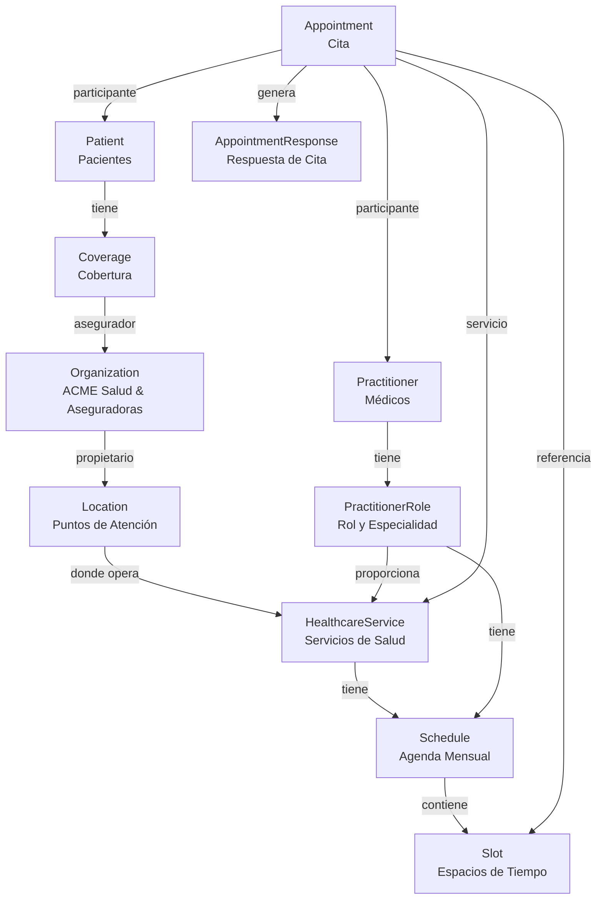

# Documento de Arquitectura - Sistema de Agenda FHIR

## ACME Salud

**Versión:** 1.0  
**Fecha:** 20 de abril de 2026  
**Proyecto:** Sistema Unificado de Agendas FHIR

---

## 1. Resumen Ejecutivo

### 1.1 Descripción del Proyecto

Sistema de gestión unificada de agendas médicas para ACME Salud, basado en el estándar FHIR (Fast Healthcare Interoperability Resources), que integra tres puntos de atención y múltiples canales de solicitud de citas.

### 1.2 Objetivos

- Unificar el sistema de agendas de los 3 puntos de atención
- Implementar interoperabilidad mediante recursos FHIR R4/R5
- Permitir agendamiento multicanal
- Gestionar tiempos de consulta según asegurador
- Mantener trazabilidad completa de citas

---

## 2. Contexto del Negocio

### 2.1 Organización

**ACME Salud** - IPS de primer y segundo nivel de complejidad

### 2.2 Puntos de Atención

| Clínica | Identificador | Servicios                                       |
| ------- | ------------- | ----------------------------------------------- |
| Norte   | 1100155555-1  | Medicina general, pediatría, obstetricia        |
| Centro  | 1100155555-2  | Medicina general, nefrología, gastroenterología |
| Sur     | 1100155555-3  | Medicina general, oncología, cardiología        |

### 2.3 Especialistas de Alta Demanda

| Nombre             | Tarjeta Profesional | Especialidad       |
| ------------------ | ------------------- | ------------------ |
| Gregorio Casas     | 111222333           | Pediatría          |
| Elmer Luna         | 222333444           | Gineco Obstetricia |
| Luis Manuel Chávez | 333444555           | Nefrología         |
| Alvaro Silva       | 444777333           | Gastroenterología  |
| Diego Narvaez      | 555222999           | Oncología          |
| Alonso Fonseca     | 777666555           | Cardiología        |

### 2.4 Aseguradoras en Convenio

1. Salud Completa
2. Salud Cooperativa

### 2.5 Tiempos de Consulta por Asegurador

| Tipo de Consulta                   | Salud Cooperativa | Salud Completa |
| ---------------------------------- | ----------------- | -------------- |
| Primera vez medicina general       | 30 min            | 45 min         |
| Primera vez especializada          | 45 min            | 60 min         |
| Control medicina general           | 20 min            | 30 min         |
| Control medicina especializada     | 30 min            | 45 min         |
| Control telemedicina general       | 15 min            | 25 min         |
| Control telemedicina especializada | 20 min            | 30 min         |

### 2.6 Canales de Atención

1. Sitio web ACME Salud
2. Call Center
3. Aplicación móvil
4. Ventanilla (HIS en cada punto)

---

## 3. Arquitectura del Sistema

### 3.1 Arquitectura General

```
┌─────────────────────────────────────────────────────────────┐
│                    CANALES DE ATENCIÓN                       │
├──────────────┬──────────────┬──────────────┬────────────────┤
│   Sitio Web  │  Call Center │  App Móvil   │  Ventanilla    │
│   (React)    │  (CRM/CTI)   │  (Flutter)   │  (HIS Module)  │
└──────┬───────┴──────┬───────┴──────┬───────┴────────┬───────┘
       │              │              │                │
       └──────────────┴──────────────┴────────────────┘
                            │
                            ▼
       ┌────────────────────────────────────────────┐
       │         API Gateway / Load Balancer        │
       │          (nginx / Apache)                  │
       └────────────────┬───────────────────────────┘
                        │
                        ▼
       ┌────────────────────────────────────────────┐
       │      FHIR Server Central (PHP/Laravel)     │
       │                                            │
       │  ┌──────────────────────────────────┐     │
       │  │   API RESTful FHIR R4/R5         │     │
       │  │   - Endpoints CRUD por recurso   │     │
       │  │   - Validación FHIR              │     │
       │  │   - Búsqueda parametrizada       │     │
       │  │   - Operaciones batch            │     │
       │  └──────────────────────────────────┘     │
       │                                            │
       │  ┌──────────────────────────────────┐     │
       │  │   Lógica de Negocio              │     │
       │  │   - Gestión de agendas           │     │
       │  │   - Asignación de slots          │     │
       │  │   - Validación de disponibilidad │     │
       │  │   - Cálculo de tiempos           │     │
       │  └──────────────────────────────────┘     │
       │                                            │
       │  ┌──────────────────────────────────┐     │
       │  │   Servicios de Soporte           │     │
       │  │   - Autenticación (OAuth2/SMART) │     │
       │  │   - Logging & Auditoría          │     │
       │  │   - Notificaciones               │     │
       │  │   - Cache (Redis)                │     │
       │  └──────────────────────────────────┘     │
       └────────────────┬───────────────────────────┘
                        │
                        ▼
       ┌────────────────────────────────────────────┐
       │          Base de Datos                     │
       │    MySQL/PostgreSQL + FHIR Schema          │
       │                                            │
       │  - Recursos FHIR (JSON/JSONB)             │
       │  - Índices optimizados                    │
       │  - Versionado de recursos                 │
       └────────────────────────────────────────────┘
```

### 3.2 Modelo de Datos FHIR

#### 3.2.1 Recursos FHIR Utilizados



#### 3.2.2 Mapeo de Recursos

| Entidad de Negocio         | Recurso FHIR        | Propósito                       |
| -------------------------- | ------------------- | ------------------------------- |
| ACME Salud                 | Organization        | Institución principal           |
| Aseguradoras               | Organization        | Organizaciones pagadoras        |
| Clínica Norte/Centro/Sur   | Location            | Ubicaciones físicas             |
| Pediatría, Nefrología, etc | HealthcareService   | Servicios especializados        |
| Médicos especialistas      | Practitioner        | Profesionales de salud          |
| Médico como empleado       | PractitionerRole    | Rol en la organización          |
| Agenda mensual de servicio | Schedule            | Planificación de disponibilidad |
| Espacio de 30/45/60 min    | Slot                | Ranuras de tiempo               |
| Paciente                   | Patient             | Persona que solicita cita       |
| Afiliación del paciente    | Coverage            | Relación con asegurador         |
| Solicitud de cita          | Appointment         | Reserva de tiempo               |
| Confirmación               | AppointmentResponse | Respuesta del participante      |

---

## 4. Decisiones de Arquitectura

### 4.1 Framework PHP Recomendado: **Laravel**

#### 4.1.1 Justificación

**Laravel 11+** es el framework recomendado por:

1. **Madurez y Comunidad**
   - Framework PHP más popular
   - Extensa documentación
   - Gran ecosistema de paquetes

2. **Características Técnicas**
   - Eloquent ORM para modelado de datos
   - API Resources para transformación FHIR
   - Validación robusta
   - Sistema de eventos para notificaciones
   - Queue system para procesamiento asíncrono
   - Cache integrado (Redis/Memcached)

3. **Paquetes FHIR Disponibles**
   - `fhir/resources` - Modelos FHIR en PHP
   - `dakujem/fhir-php` - Cliente FHIR
   - Posibilidad de crear wrapper personalizado

4. **Seguridad**
   - Laravel Passport (OAuth2)
   - SMART on FHIR implementable
   - Protección CSRF
   - Encriptación integrada

5. **Escalabilidad**
   - Horizontal scaling con load balancing
   - Optimización de queries
   - Cache distribuido
   - Queue workers

#### 4.1.2 Alternativas Consideradas

| Framework  | Ventajas                                  | Desventajas                               | Decisión            |
| ---------- | ----------------------------------------- | ----------------------------------------- | ------------------- |
| Laravel    | Ecosistema completo, moderno, ORM potente | Curva de aprendizaje inicial              | ✅ **Seleccionado** |
| Symfony    | Altamente modular, robusto                | Más complejo, menos intuitivo             | ❌ Descartado       |
| Slim/Lumen | Ligero, rápido                            | Requiere más configuración manual         | ❌ Descartado       |
| PHP Puro   | Control total                             | Desarrollo más lento, reinventar la rueda | ❌ Descartado       |

### 4.2 Base de Datos: **PostgreSQL**

**Justificación:**

- Soporte nativo JSON/JSONB (ideal para recursos FHIR)
- Índices GIN/GiST para búsquedas en JSON
- Robustez y cumplimiento ACID
- Extensiones útiles (uuid-ossp, pg_trgm)
- Mejor performance en queries complejos

**Alternativa:** MySQL 8+ (también soporta JSON)

### 4.3 Cache: **Redis**

- Cache de recursos frecuentes
- Gestión de sesiones
- Rate limiting
- Queue backend

### 4.4 Autenticación: **OAuth 2.0 + SMART on FHIR**

- Estándar de la industria para FHIR
- Scopes granulares por recurso
- Integración con sistemas externos

---

## 5. Componentes del Sistema

### 5.1 Servidor FHIR Central (Laravel)

#### 5.1.1 Estructura del Proyecto

```
agenda-fhir/
├── app/
│   ├── Http/
│   │   ├── Controllers/
│   │   │   ├── FHIR/
│   │   │   │   ├── OrganizationController.php
│   │   │   │   ├── LocationController.php
│   │   │   │   ├── PractitionerController.php
│   │   │   │   ├── PractitionerRoleController.php
│   │   │   │   ├── HealthcareServiceController.php
│   │   │   │   ├── ScheduleController.php
│   │   │   │   ├── SlotController.php
│   │   │   │   ├── PatientController.php
│   │   │   │   ├── CoverageController.php
│   │   │   │   ├── AppointmentController.php
│   │   │   │   └── AppointmentResponseController.php
│   │   └── Resources/
│   │       └── FHIR/
│   │           ├── OrganizationResource.php
│   │           ├── AppointmentResource.php
│   │           └── ...
│   ├── Models/
│   │   ├── Organization.php
│   │   ├── Location.php
│   │   ├── Practitioner.php
│   │   ├── HealthcareService.php
│   │   ├── Schedule.php
│   │   ├── Slot.php
│   │   ├── Patient.php
│   │   ├── Coverage.php
│   │   ├── Appointment.php
│   │   └── AppointmentResponse.php
│   ├── Services/
│   │   ├── FHIRValidator.php
│   │   ├── ScheduleManager.php
│   │   ├── SlotAllocator.php
│   │   └── AppointmentService.php
│   ├── Events/
│   │   ├── AppointmentCreated.php
│   │   ├── AppointmentCancelled.php
│   │   └── SlotReleased.php
│   └── Listeners/
│       ├── SendAppointmentConfirmation.php
│       └── NotifyPractitioner.php
├── database/
│   ├── migrations/
│   └── seeders/
├── routes/
│   ├── api.php (rutas FHIR)
│   └── web.php
├── config/
│   └── fhir.php
└── tests/
    ├── Feature/
    └── Unit/
```

#### 5.1.2 Endpoints API FHIR

**Base URL:** `https://api.acmesalud.com/fhir/`

| Recurso             | Endpoint               | Métodos                | Descripción               |
| ------------------- | ---------------------- | ---------------------- | ------------------------- |
| Organization        | `/Organization`        | GET, POST, PUT, DELETE | Gestión de organizaciones |
| Location            | `/Location`            | GET, POST, PUT, DELETE | Puntos de atención        |
| Practitioner        | `/Practitioner`        | GET, POST, PUT, DELETE | Médicos                   |
| PractitionerRole    | `/PractitionerRole`    | GET, POST, PUT, DELETE | Roles médicos             |
| HealthcareService   | `/HealthcareService`   | GET, POST, PUT, DELETE | Servicios de salud        |
| Schedule            | `/Schedule`            | GET, POST, PUT, DELETE | Agendas                   |
| Slot                | `/Slot`                | GET, POST, PUT, DELETE | Espacios de tiempo        |
| Patient             | `/Patient`             | GET, POST, PUT, DELETE | Pacientes                 |
| Coverage            | `/Coverage`            | GET, POST, PUT, DELETE | Coberturas                |
| Appointment         | `/Appointment`         | GET, POST, PUT, DELETE | Citas                     |
| AppointmentResponse | `/AppointmentResponse` | GET, POST, PUT, DELETE | Respuestas                |

**Operaciones especiales:**

- `GET /Slot?schedule=Schedule/123&status=free` - Buscar slots disponibles
- `POST /Appointment/$book` - Reservar cita
- `POST /Appointment/{id}/$cancel` - Cancelar cita
- `GET /Schedule?actor=Practitioner/123&date=2026-05` - Agenda de médico

### 5.2 Canales de Atención (Clientes)

#### 5.2.1 Sitio Web (React + TypeScript)

**Tecnologías:**

- React 18+
- TypeScript
- TanStack Query (react-query) para FHIR API
- fhir-kit-client
- Material-UI / Tailwind CSS

**Funcionalidades:**

- Búsqueda de especialistas
- Visualización de disponibilidad
- Solicitud de citas
- Gestión de cuenta paciente

#### 5.2.2 Aplicación Móvil (Flutter)

**Tecnologías:**

- Flutter 3+
- fhir_dart package
- Provider/Riverpod para state management

**Funcionalidades:**

- Mismas del sitio web
- Notificaciones push
- Recordatorios de citas

#### 5.2.3 Sistema Call Center

**Integración:**

- API REST FHIR
- Panel de administración (Laravel Nova / Filament)
- CTI integration

#### 5.2.4 Módulo HIS (Ventanilla)

**Integración:**

- Cliente FHIR standalone
- API REST consumo directo
- Sincronización bidireccional

---

## 6. Flujos de Proceso

### 6.1 Creación de Agenda Mensual

```
1. Administrador selecciona mes y año
2. Para cada HealthcareService:
   a. Crear Schedule con período mensual
   b. Definir días y horarios de atención
   c. Generar Slots según duración por asegurador
3. Para cada Practitioner con PractitionerRole:
   a. Crear Schedule personal
   b. Generar Slots según disponibilidad
4. Publicar agendas (status = active)
```

### 6.2 Solicitud de Cita

```
┌─────────┐
│ Paciente│
│ Ingresa │
└────┬────┘
     │
     ▼
┌─────────────────────┐
│ Selecciona:         │
│ - Especialidad      │
│ - Médico (opcional) │
│ - Fecha preferida   │
└─────────┬───────────┘
          │
          ▼
┌─────────────────────────┐
│ Sistema busca:          │
│ GET /Slot?              │
│   service=HS/123&       │
│   status=free&          │
│   start=ge2026-05-01    │
└─────────┬───────────────┘
          │
          ▼
┌─────────────────────────┐
│ Muestra slots           │
│ disponibles             │
└─────────┬───────────────┘
          │
          ▼
┌─────────────────────────┐
│ Paciente selecciona     │
│ slot                    │
└─────────┬───────────────┘
          │
          ▼
┌─────────────────────────┐
│ Sistema:                │
│ 1. Obtiene Coverage     │
│ 2. Calcula duración     │
│ 3. Crea Appointment     │
│ 4. Actualiza Slot       │
│    (status=busy)        │
└─────────┬───────────────┘
          │
          ▼
┌─────────────────────────┐
│ Genera                  │
│ AppointmentResponse     │
└─────────┬───────────────┘
          │
          ▼
┌─────────────────────────┐
│ Envía confirmación      │
│ (Email/SMS/Notif)       │
└─────────────────────────┘
```

### 6.3 Cancelación de Cita

```
1. Paciente solicita cancelación
2. Sistema valida permisos
3. Actualiza Appointment:
   - status = "cancelled"
   - cancelationReason = CodeableConcept
4. Libera Slot (status = "free")
5. Dispara evento AppointmentCancelled
6. Notifica a partes involucradas
```

---

## 7. Modelo de Datos Detallado

### 7.1 Esquema de Base de Datos

```sql
-- Tabla base para todos los recursos FHIR
CREATE TABLE fhir_resources (
    id UUID PRIMARY KEY DEFAULT uuid_generate_v4(),
    resource_type VARCHAR(50) NOT NULL,
    fhir_version VARCHAR(10) DEFAULT 'R4',
    data JSONB NOT NULL,
    meta_version_id INTEGER DEFAULT 1,
    meta_last_updated TIMESTAMP DEFAULT CURRENT_TIMESTAMP,
    status VARCHAR(20),
    created_at TIMESTAMP DEFAULT CURRENT_TIMESTAMP,
    updated_at TIMESTAMP DEFAULT CURRENT_TIMESTAMP,
    deleted_at TIMESTAMP
);

-- Índices para búsquedas rápidas
CREATE INDEX idx_resource_type ON fhir_resources(resource_type);
CREATE INDEX idx_status ON fhir_resources(status) WHERE status IS NOT NULL;
CREATE INDEX idx_data_gin ON fhir_resources USING GIN (data);

-- Índices específicos por tipo de recurso
CREATE INDEX idx_appointment_patient ON fhir_resources
    USING GIN ((data->'participant'))
    WHERE resource_type = 'Appointment';

CREATE INDEX idx_slot_schedule ON fhir_resources
    ((data->>'schedule'))
    WHERE resource_type = 'Slot';

-- Vistas materializadas para reportes
CREATE MATERIALIZED VIEW mv_appointments_summary AS
SELECT
    (data->>'id') as appointment_id,
    (data->>'status') as status,
    (data->>'start')::timestamp as start_time,
    (data->'participant'->0->'actor'->>'reference') as patient_ref,
    (data->'serviceType'->0->'coding'->0->>'display') as service_type
FROM fhir_resources
WHERE resource_type = 'Appointment';
```

### 7.2 Ejemplos de Recursos FHIR

#### 7.2.1 Organization (ACME Salud)

```json
{
  "resourceType": "Organization",
  "id": "acme-salud",
  "identifier": [
    {
      "system": "urn:co:nit",
      "value": "1100155555"
    }
  ],
  "active": true,
  "type": [
    {
      "coding": [
        {
          "system": "http://terminology.hl7.org/CodeSystem/organization-type",
          "code": "prov",
          "display": "Healthcare Provider"
        }
      ]
    }
  ],
  "name": "ACME Salud",
  "telecom": [
    {
      "system": "phone",
      "value": "+57 1 234 5678"
    },
    {
      "system": "email",
      "value": "contacto@acmesalud.com"
    },
    {
      "system": "url",
      "value": "https://www.acmesalud.com"
    }
  ]
}
```

#### 7.2.2 Location (Clínica Norte)

```json
{
  "resourceType": "Location",
  "id": "clinica-norte",
  "identifier": [
    {
      "system": "urn:co:sede",
      "value": "1100155555-1"
    }
  ],
  "status": "active",
  "name": "Clínica Norte",
  "mode": "instance",
  "type": [
    {
      "coding": [
        {
          "system": "http://terminology.hl7.org/CodeSystem/v3-RoleCode",
          "code": "HOSP",
          "display": "Hospital"
        }
      ]
    }
  ],
  "managingOrganization": {
    "reference": "Organization/acme-salud"
  }
}
```

#### 7.2.3 Practitioner (Dr. Gregorio Casas)

```json
{
  "resourceType": "Practitioner",
  "id": "practitioner-casas",
  "identifier": [
    {
      "system": "urn:co:tarjeta-profesional",
      "value": "111222333"
    }
  ],
  "active": true,
  "name": [
    {
      "family": "Casas",
      "given": ["Gregorio"]
    }
  ],
  "qualification": [
    {
      "code": {
        "coding": [
          {
            "system": "http://snomed.info/sct",
            "code": "394537008",
            "display": "Pediatrics"
          }
        ],
        "text": "Pediatría"
      }
    }
  ]
}
```

#### 7.2.4 PractitionerRole

```json
{
  "resourceType": "PractitionerRole",
  "id": "role-casas-pediatria",
  "active": true,
  "practitioner": {
    "reference": "Practitioner/practitioner-casas"
  },
  "organization": {
    "reference": "Organization/acme-salud"
  },
  "location": [
    {
      "reference": "Location/clinica-norte"
    }
  ],
  "specialty": [
    {
      "coding": [
        {
          "system": "http://snomed.info/sct",
          "code": "394537008",
          "display": "Pediatrics"
        }
      ]
    }
  ],
  "availableTime": [
    {
      "daysOfWeek": ["mon", "wed", "fri"],
      "availableStartTime": "08:00:00",
      "availableEndTime": "12:00:00"
    },
    {
      "daysOfWeek": ["tue", "thu"],
      "availableStartTime": "14:00:00",
      "availableEndTime": "18:00:00"
    }
  ]
}
```

#### 7.2.5 HealthcareService

```json
{
  "resourceType": "HealthcareService",
  "id": "servicio-pediatria-norte",
  "active": true,
  "providedBy": {
    "reference": "Organization/acme-salud"
  },
  "location": [
    {
      "reference": "Location/clinica-norte"
    }
  ],
  "type": [
    {
      "coding": [
        {
          "system": "http://snomed.info/sct",
          "code": "394537008",
          "display": "Pediatrics"
        }
      ],
      "text": "Pediatría"
    }
  ],
  "specialty": [
    {
      "coding": [
        {
          "system": "http://snomed.info/sct",
          "code": "394537008",
          "display": "Pediatrics"
        }
      ]
    }
  ],
  "name": "Servicio de Pediatría - Clínica Norte"
}
```

#### 7.2.6 Schedule

```json
{
  "resourceType": "Schedule",
  "id": "schedule-casas-mayo-2026",
  "active": true,
  "serviceType": [
    {
      "coding": [
        {
          "system": "http://snomed.info/sct",
          "code": "394537008",
          "display": "Pediatrics"
        }
      ]
    }
  ],
  "actor": [
    {
      "reference": "Practitioner/practitioner-casas"
    },
    {
      "reference": "PractitionerRole/role-casas-pediatria"
    },
    {
      "reference": "Location/clinica-norte"
    }
  ],
  "planningHorizon": {
    "start": "2026-05-01T00:00:00Z",
    "end": "2026-05-31T23:59:59Z"
  },
  "comment": "Agenda de mayo 2026 - Dr. Gregorio Casas"
}
```

#### 7.2.7 Slot

```json
{
  "resourceType": "Slot",
  "id": "slot-20260505-0800",
  "schedule": {
    "reference": "Schedule/schedule-casas-mayo-2026"
  },
  "status": "free",
  "start": "2026-05-05T08:00:00Z",
  "end": "2026-05-05T08:45:00Z",
  "comment": "Primera vez - Salud Completa (45 min)"
}
```

#### 7.2.8 Patient

```json
{
  "resourceType": "Patient",
  "id": "patient-12345",
  "identifier": [
    {
      "type": {
        "coding": [
          {
            "system": "http://terminology.hl7.org/CodeSystem/v2-0203",
            "code": "NI",
            "display": "National unique individual identifier"
          }
        ]
      },
      "system": "urn:co:cc",
      "value": "1234567890"
    }
  ],
  "active": true,
  "name": [
    {
      "family": "Rodríguez",
      "given": ["María", "Fernanda"]
    }
  ],
  "telecom": [
    {
      "system": "phone",
      "value": "+57 300 1234567",
      "use": "mobile"
    },
    {
      "system": "email",
      "value": "maria.rodriguez@email.com"
    }
  ],
  "gender": "female",
  "birthDate": "1985-03-15"
}
```

#### 7.2.9 Coverage

```json
{
  "resourceType": "Coverage",
  "id": "coverage-12345",
  "status": "active",
  "beneficiary": {
    "reference": "Patient/patient-12345"
  },
  "payor": [
    {
      "reference": "Organization/salud-completa",
      "display": "Salud Completa"
    }
  ],
  "class": [
    {
      "type": {
        "coding": [
          {
            "system": "http://terminology.hl7.org/CodeSystem/coverage-class",
            "code": "plan"
          }
        ]
      },
      "value": "plan-oro",
      "name": "Plan Oro"
    }
  ]
}
```

#### 7.2.10 Appointment

```json
{
  "resourceType": "Appointment",
  "id": "appointment-001",
  "status": "booked",
  "serviceType": [
    {
      "coding": [
        {
          "system": "http://snomed.info/sct",
          "code": "394537008",
          "display": "Pediatrics"
        }
      ]
    }
  ],
  "appointmentType": {
    "coding": [
      {
        "system": "http://terminology.hl7.org/CodeSystem/v2-0276",
        "code": "ROUTINE",
        "display": "Routine appointment"
      }
    ]
  },
  "reasonCode": [
    {
      "text": "Primera vez - Consulta pediátrica"
    }
  ],
  "priority": 5,
  "start": "2026-05-05T08:00:00Z",
  "end": "2026-05-05T08:45:00Z",
  "created": "2026-04-20T10:30:00Z",
  "comment": "Paciente con cobertura Salud Completa - 45 minutos",
  "participant": [
    {
      "actor": {
        "reference": "Patient/patient-12345",
        "display": "María Fernanda Rodríguez"
      },
      "required": "required",
      "status": "accepted"
    },
    {
      "actor": {
        "reference": "Practitioner/practitioner-casas",
        "display": "Dr. Gregorio Casas"
      },
      "required": "required",
      "status": "accepted"
    },
    {
      "actor": {
        "reference": "Location/clinica-norte",
        "display": "Clínica Norte"
      },
      "required": "required",
      "status": "accepted"
    }
  ],
  "slot": [
    {
      "reference": "Slot/slot-20260505-0800"
    }
  ]
}
```

#### 7.2.11 AppointmentResponse

```json
{
  "resourceType": "AppointmentResponse",
  "id": "response-001",
  "appointment": {
    "reference": "Appointment/appointment-001"
  },
  "start": "2026-05-05T08:00:00Z",
  "end": "2026-05-05T08:45:00Z",
  "participantType": [
    {
      "coding": [
        {
          "system": "http://terminology.hl7.org/CodeSystem/v3-ParticipationType",
          "code": "PPRF",
          "display": "primary performer"
        }
      ]
    }
  ],
  "actor": {
    "reference": "Patient/patient-12345"
  },
  "participantStatus": "accepted",
  "comment": "Cita confirmada. Por favor llegar 15 minutos antes."
}
```

---

## 8. Seguridad

### 8.1 Autenticación y Autorización

#### 8.1.1 OAuth 2.0 + SMART on FHIR

```php
// Scopes definidos
$scopes = [
    'patient/*.read',           // Leer todos los recursos del paciente
    'patient/Appointment.read', // Leer citas del paciente
    'patient/Appointment.write',// Crear/modificar citas del paciente
    'user/Schedule.read',       // Personal médico lee agendas
    'user/Slot.write',          // Personal médico modifica slots
    'system/*.read',            // Sistema lee todos los recursos
    'system/*.write'            // Sistema escribe todos los recursos
];
```

#### 8.1.2 Roles y Permisos

| Rol            | Permisos               | Recursos Accesibles                                          |
| -------------- | ---------------------- | ------------------------------------------------------------ |
| Paciente       | read/write propios     | Patient, Coverage, Appointment (propio), AppointmentResponse |
| Médico         | read/write agenda      | Practitioner, Schedule, Slot, Appointment (asignados)        |
| Administrativo | read/write all         | Todos excepto modificar Coverage                             |
| Call Center    | read/write appointment | Patient, Appointment, Schedule, Slot                         |
| Sistema        | full access            | Todos                                                        |

### 8.2 Medidas de Seguridad

1. **Transporte**: HTTPS/TLS 1.3
2. **Datos en reposo**: Encriptación AES-256
3. **Logs de auditoría**: Registro de todas las operaciones
4. **Rate limiting**: 100 req/min por IP
5. **CORS**: Configuración restrictiva
6. **Validación**: Schemas FHIR strict
7. **Sanitización**: Prevención XSS/SQL Injection

---

## 9. Consideraciones de Rendimiento

### 9.1 Estrategias de Optimización

1. **Caching**
   - Redis para recursos frecuentes (Organization, Location, HealthcareService)
   - TTL: 1 hora para datos maestros
   - Invalidación en actualizaciones

2. **Índices de Base de Datos**
   - Índices GIN en campos JSONB
   - Índices específicos por tipo de búsqueda
   - Vistas materializadas para reportes

3. **Paginación**
   - Límite: 50 recursos por página
   - Links FHIR (first, last, next, prev)

4. **Lazy Loading**
   - Carga bajo demanda de referencias
   - Bundle resources cuando sea apropiado

5. **Queue System**
   - Jobs asíncronos para notificaciones
   - Procesamiento batch de agendas

### 9.2 Métricas de Performance

| Operación           | Tiempo Objetivo | Max Concurrente |
| ------------------- | --------------- | --------------- |
| GET single resource | < 100ms         | 1000 req/s      |
| POST create         | < 300ms         | 200 req/s       |
| Search query        | < 500ms         | 500 req/s       |
| Appointment booking | < 1s            | 100 req/s       |

---

## 10. Plan de Implementación

### 10.1 Fases del Proyecto

#### Fase 1: Infraestructura y Setup (2 semanas)

- Configuración entorno Laravel
- Setup base de datos PostgreSQL
- Configuración Redis
- CI/CD pipeline
- Entorno de desarrollo/staging/producción

#### Fase 2: Recursos Base (3 semanas)

- Implementar Organization, Location
- Implementar Practitioner, PractitionerRole
- Implementar HealthcareService
- Testing unitario

#### Fase 3: Sistema de Agendas (3 semanas)

- Implementar Schedule
- Implementar Slot
- Lógica de generación de slots
- Algoritmo de asignación

#### Fase 4: Gestión de Citas (3 semanas)

- Implementar Patient, Coverage
- Implementar Appointment
- Implementar AppointmentResponse
- Lógica de negocio completa

#### Fase 5: Seguridad y Autenticación (2 semanas)

- OAuth 2.0 implementation
- SMART on FHIR
- Roles y permisos
- Auditoría

#### Fase 6: Clientes (4 semanas)

- Sitio web (React)
- API Gateway
- Integración Call Center
- Módulo HIS

#### Fase 7: Testing y QA (2 semanas)

- Testing de integración
- Testing de carga
- Testing de seguridad
- Bug fixing

#### Fase 8: Deployment (1 semana)

- Migración de datos
- Deployment producción
- Monitoring setup
- Documentación

**Total: 20 semanas (5 meses)**

### 10.2 Stack Tecnológico Completo

```yaml
Backend:
  - PHP: 8.2+
  - Framework: Laravel 11
  - Base de Datos: PostgreSQL 15+
  - Cache: Redis 7+
  - Queue: Laravel Horizon
  - FHIR Library: fhir/resources

Frontend Web:
  - React: 18+
  - TypeScript: 5+
  - FHIR Client: fhir-kit-client
  - State: TanStack Query
  - UI: Material-UI / Tailwind CSS

Frontend Mobile:
  - Flutter: 3+
  - FHIR: fhir_dart
  - State: Provider/Riverpod

DevOps:
  - Containers: Docker + Docker Compose
  - Orchestration: Kubernetes (opcional)
  - CI/CD: GitHub Actions / GitLab CI
  - Monitoring: Prometheus + Grafana
  - Logging: ELK Stack

Infraestructura:
  - Web Server: nginx
  - Application Server: PHP-FPM
  - Load Balancer: nginx / HAProxy
  - SSL: Let's Encrypt
```

---

## 11. Testing

### 11.1 Estrategia de Testing

```php
// Ejemplo de test unitario
class AppointmentServiceTest extends TestCase
{
    public function test_can_create_appointment_with_valid_slot()
    {
        $patient = Patient::factory()->create();
        $slot = Slot::factory()->free()->create();

        $appointment = $this->appointmentService->book([
            'patient_id' => $patient->id,
            'slot_id' => $slot->id,
            'reason' => 'Primera vez'
        ]);

        $this->assertNotNull($appointment);
        $this->assertEquals('booked', $appointment->status);
        $this->assertEquals('busy', $slot->fresh()->status);
    }

    public function test_cannot_book_occupied_slot()
    {
        $slot = Slot::factory()->busy()->create();

        $this->expectException(SlotNotAvailableException::class);

        $this->appointmentService->book([
            'slot_id' => $slot->id
        ]);
    }
}
```

### 11.2 Niveles de Testing

1. **Unit Tests**: 80%+ cobertura
2. **Integration Tests**: Flujos completos
3. **API Tests**: Conformidad FHIR
4. **Load Tests**: 1000+ usuarios concurrentes
5. **Security Tests**: Penetration testing

---

## 12. Monitoreo y Mantenimiento

### 12.1 Métricas Clave (KPIs)

- Disponibilidad del servicio: 99.9%
- Tiempo de respuesta promedio: < 500ms
- Tasa de error: < 0.1%
- Citas agendadas/día
- Tasa de cancelación
- Uso por canal

### 12.2 Alertas

- Downtime del servidor
- Error rate > 1%
- Response time > 2s
- Disco > 80%
- CPU > 90%

---

## 13. Costos Estimados

### 13.1 Infraestructura (Mensual)

| Componente      | Especificación       | Costo (USD)  |
| --------------- | -------------------- | ------------ |
| App Server      | 4 vCPU, 8GB RAM      | $80          |
| Database        | PostgreSQL 100GB SSD | $100         |
| Redis           | 2GB                  | $30          |
| Load Balancer   | -                    | $20          |
| Backup          | 500GB                | $25          |
| SSL Certificate | Let's Encrypt        | $0           |
| **Total**       |                      | **$255/mes** |

### 13.2 Desarrollo

| Fase                | Duración       | Costo Estimado |
| ------------------- | -------------- | -------------- |
| Desarrollo Backend  | 14 semanas     | $28,000        |
| Desarrollo Frontend | 6 semanas      | $12,000        |
| Testing y QA        | 3 semanas      | $6,000         |
| Deployment          | 1 semana       | $2,000         |
| **Total**           | **24 semanas** | **$48,000**    |

---

## 14. Riesgos y Mitigación

| Riesgo                      | Probabilidad | Impacto | Mitigación                              |
| --------------------------- | ------------ | ------- | --------------------------------------- |
| Complejidad FHIR            | Media        | Alto    | Capacitación, consultoría especializada |
| Integración sistemas legacy | Alta         | Medio   | Adaptadores, testing exhaustivo         |
| Performance bajo carga      | Media        | Alto    | Load testing, optimización proactiva    |
| Seguridad                   | Baja         | Crítico | Auditorías, penetration testing         |
| Cambios regulatorios        | Media        | Medio   | Arquitectura flexible, FHIR estándar    |

---

## 15. Conclusiones

### 15.1 Beneficios Esperados

1. **Interoperabilidad**: Sistema basado en estándar internacional FHIR
2. **Escalabilidad**: Arquitectura preparada para crecimiento
3. **Unificación**: Un solo sistema para todos los canales
4. **Trazabilidad**: Registro completo de operaciones
5. **Flexibilidad**: Fácil integración de nuevos canales

### 15.2 Recomendaciones

1. **Adoptar Laravel** como framework PHP principal
2. **Implementar en fases** para mitigar riesgos
3. **Priorizar testing** desde el inicio
4. **Capacitar al equipo** en FHIR
5. **Establecer monitoring** proactivo

---

## 16. Referencias

### 16.1 Bibliografía

1. **HL7 FHIR Specification R4**  
   https://www.hl7.org/fhir/R4/

2. **FHIR Appointment Resources**  
   https://www.hl7.org/fhir/appointment.html

3. **SMART on FHIR**  
   https://docs.smarthealthit.org/

4. **Laravel Documentation**  
   https://laravel.com/docs

5. **FHIR Implementation Guide**  
   https://build.fhir.org/ig/

6. **HL7 Colombia**  
   https://www.hl7.org.co/

7. **SNOMED CT**  
   https://www.snomed.org/

8. **Interoperabilidad en Salud - MinSalud Colombia**  
   https://www.minsalud.gov.co/

### 16.2 Herramientas Útiles

- **FHIR Validator**: https://validator.fhir.org/
- **FHIR Path Tester**: https://fhirpath.com/
- **Postman FHIR**: Colección de ejemplos
- **HAPI FHIR**: Servidor de referencia Java

---

## Anexos

### A. Glosario de Términos

- **FHIR**: Fast Healthcare Interoperability Resources
- **HL7**: Health Level Seven International
- **IPS**: Institución Prestadora de Servicios de Salud
- **HIS**: Health Information System
- **OAuth**: Open Authorization
- **SMART**: Substitutable Medical Applications, Reusable Technologies
- **REST**: Representational State Transfer
- **CRUD**: Create, Read, Update, Delete

### B. Contactos del Proyecto

```
Arquitecto de Software: [Nombre]
Analista FHIR: [Nombre]
Tech Lead: [Nombre]
Product Owner: [Nombre]
```

---

**Documento elaborado por:** [Equipo de Desarrollo]  
**Fecha de elaboración:** 20 de abril de 2026  
**Versión:** 1.0  
**Estado:** Propuesta Inicial
